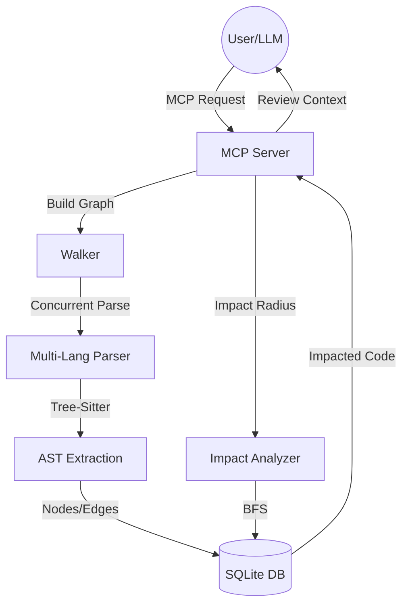

# go-crg: Go Code Review Graph

`go-crg` is a high-performance, concurrent tool designed to optimize code reviews for both humans and LLMs. By building a structural knowledge graph of your codebase using Tree-sitter, it identifies the "blast radius" of any change, ensuring that reviews are focused only on the affected components.

## 🚀 Key Features

- **Concurrent Parsing**: Uses Go's `errgroup` to parse hundreds of files in parallel, delivering sub-second updates.
- **Multi-Language Support**: Powered by Tree-sitter, currently supporting **Go** and **Python** (with more coming).
- **CGO-Free Persistence**: Uses a pure Go SQLite implementation to store nodes (functions, classes) and edges (calls, contains).
- **MCP Integration**: Exposes its capabilities as a Model Context Protocol (MCP) server, allowing LLMs like Claude to perform impact analysis autonomously.
- **Blast Radius Analysis**: Uses BFS traversal to find all callers and dependents of modified code.

## 🏗 Architecture



## 🛠 How It Works

### 1. The Walker & Parser
The **Walker** scans the repository for supported file extensions. It spawns a pool of worker goroutines that use **Tree-sitter** to parse the source code. Unlike simple regex-based tools, `go-crg` understands the actual structure of the code, distinguishing between a function definition and a function call.

### 2. The Knowledge Graph
Extracted entities are stored as **Nodes** and **Edges** in a SQLite database:
- **Nodes**: Files, Functions, Classes, Types.
- **Edges**: 
    - `CONTAINS`: A file contains a class; a class contains a method.
    - `CALLS`: Function A invokes Function B.
    - `IMPORTS_FROM`: File A depends on File B.

### 3. Impact Analysis (Blast Radius)
When a file is modified, the **Impact Analyzer** performs a Breadth-First Search (BFS) on the graph. It identifies:
- **Direct Impacts**: The functions actually changed.
- **Indirect Impacts**: The callers of those functions, the classes that inherit from them, and the tests that verify them.

This "Minimal Review Set" allows for highly efficient reviews, as the reviewer (or LLM) only needs to look at the affected surface area rather than the entire file.

## 🚦 Getting Started

### Installation
```bash
git clone https://github.com/go-packs/go-crg.git
cd go-crg
go build -o crg
```

### Usage (CLI)
Currently, the primary interface is via the MCP server:
```bash
./crg
```

### MCP Tools
- `build_graph(repo_root)`: Scans the repository and populates the database.
- `get_impact_radius(changed_files, max_depth)`: Returns the list of affected nodes for the given changes.
- `get_review_context(changed_files, max_depth)`: **The Token Optimization Tool.** Returns actual source snippets for every affected node, allowing LLMs to perform reviews without reading entire files.

## 🧪 Testing
```bash
go test ./...
```

## ⚖️ License
MIT
