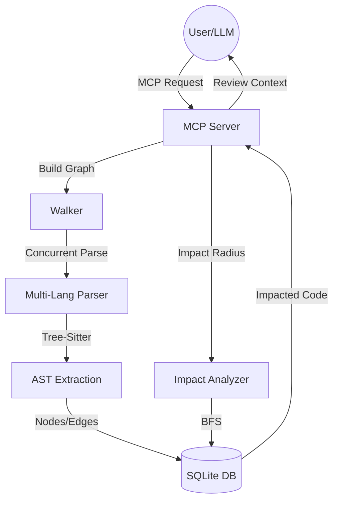

# go-crg: Go Code Review Graph

`go-crg` is a high-performance, concurrent tool designed to optimize code reviews for both humans and LLMs. By building a structural knowledge graph of your codebase using Tree-sitter, it identifies the "blast radius" of any change, ensuring that reviews are focused only on the affected components.

## 🚀 Key Features

- **Concurrent Parsing**: Uses Go's `errgroup` to parse hundreds of files in parallel, delivering sub-second updates for even large monorepos.
- **Token Optimization**: Includes a `get_review_context` tool that provides LLMs with ONLY the affected code snippets, reducing token usage by up to 90%.
- **Multi-Language Support**: Currently supporting **Go** and **Python** (built on Tree-sitter).
- **CGO-Free Persistence**: Uses a pure Go SQLite implementation for easy distribution.
- **MCP Integration**: Fully compliant with the Model Context Protocol (MCP) for seamless use with Claude Desktop and other LLM IDEs.

## 🏗 Architecture



## 🛠 How It Works

### 1. The Walker & Parser
The **Walker** recursively scans your repository for supported file extensions. It utilizes a worker pool to parse files in parallel, extracting structural nodes (Functions, Classes, Types) and relationships (Calls, Contains).

### 2. The Knowledge Graph
Extracted entities are stored as **Nodes** and **Edges** in a SQLite database:
- **Nodes**: Logical code entities (e.g., `internal/auth/service.go::AuthService.Login`).
- **Edges**: Relationships like `CALLS` (tracing dependencies) and `CONTAINS` (structural nesting).

### 3. Token Optimization (Outcome)
Standard code review tools often send entire files to an LLM, wasting thousands of tokens on irrelevant code. `go-crg` solves this by:
1. Identifying exactly which functions/methods were changed.
2. Finding the "Blast Radius" (callers and dependents).
3. Extracting **precise code snippets** (with context) for only the affected nodes.
4. **Outcome**: The LLM receives 100 lines of highly relevant code instead of 5,000 lines of noise.

## 🚦 Getting Started

### Prerequisites
- [Go 1.21+](https://go.dev/dl/)
- [Git](https://git-scm.com/)

### Installation
```bash
git clone https://github.com/go-packs/go-crg.git
cd go-crg
go build -o crg
```

### Configuration (Claude Desktop)
Add `go-crg` to your `claude_desktop_config.json`:
```json
{
  "mcpServers": {
    "go-crg": {
      "command": "/absolute/path/to/go-crg/crg"
    }
  }
}
```

## 🛠 MCP Tools
- **`build_graph(repo_root)`**: Scans the repository and populates the local knowledge graph.
- **`get_impact_radius(changed_files, max_depth)`**: Returns a list of affected nodes (functions/classes) based on the changes.
- **`get_review_context(changed_files, max_depth)`**: **The Primary Tool.** Returns actual source snippets for every affected node, providing the perfect context for an LLM to perform a code review.

## 🧪 Testing
```bash
go test ./...
```

## ⚖️ License
MIT
